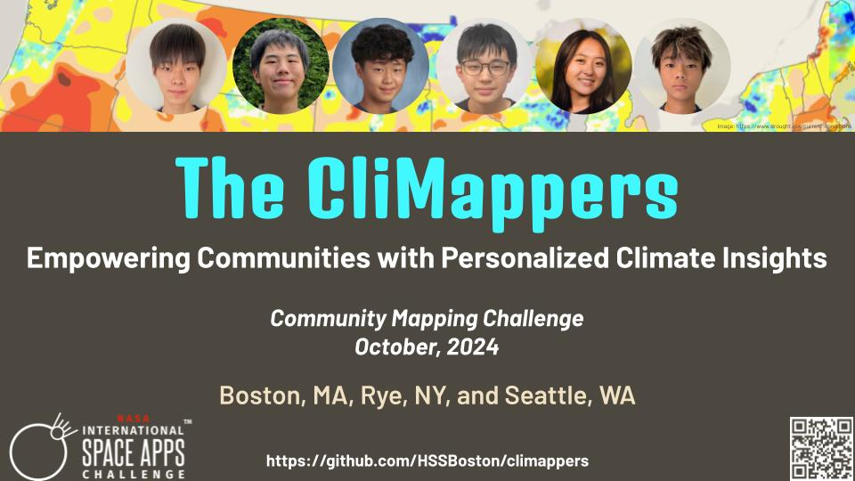

  

We are a team of 6 students who participated in the [2024 NASA Space Apps Challenge](https://www.spaceappschallenge.org/nasa-space-apps-2024/):

- Banri Ouchi
- Yuma Karube
- Hiroki Kudara
- Shun Nagata
- Hanna Suzuki
- Rei Nagata

NASA Space Apps Challenge is an annual hackathon event (or an innovation incubation and civic engagement program) where NASA puts out about 20 challenges for participants around the world to develop innovative solutions.

We participated in the [Boston division](http://spaceappsboston.org/) of Space Apps and won the **1st place** and **Kintone API Award** there! We are excited to move onto the global judging!!!

<!--
We are excited to receive [a Global Finalist Honorable Mention](https://www.spaceappschallenge.org/2023/awards/honorable-mentions/) from 8,715 teams worldwide (57,999 participants from 152 countries) by NASA and 13 other nations' space agencies!
-->

Our team worked on the [Community Mapping](https://www.spaceappschallenge.org/nasa-space-apps-2024/challenges/community-mapping/) challenge. We worked on the impacts of climate change on heat-related illness, bird conservation, drought and farming. 

<!--
We built "smart" mirrors and picture frames, each of which downloads NASA's sonification data, replays its audio portion with a speaker and displays its video/image portion with a digital display. We also designed a new sonification algorithm that sonifies constellations. Our ultimate goal is to embed sonification to daily life and better disseminate cosmic soundscape. 
-->

This web site provides hardware and software setup guide, circuit diagrams, and ready-to-run Python programs. You can immediately learn how to reproduce our devices and how to use our constellation sonifier. We hope you find this project interesting and useful and then learn something about sonification. 

- [Official team web page](https://www.spaceappschallenge.org/nasa-space-apps-2024/find-a-team/the-climappers/) at SpaceAppsChallenge.org
- [7-page project summary](https://docs.google.com/presentation/d/1-i9Uh-I4eNe0UzF6vLKNDByFIklReVsbWXHKadZfBYQ/edit?usp=sharing)
- [Oral Presentation slides](https://docs.google.com/presentation/d/1WeamII1KqAWI8Ihfe29W0ET_eX6rFyID953sO8JrFNA/edit?usp=sharing)
- 

<!-- 
- [Oral presentation video](https://youtu.be/knsCNAubOXA) for Boston local judging

- [Smart mirrors and picture frames](prototypes/)
- [Constellation Sonifier](sonifier/)
- Hardware setup: Required hardware, LED matrix wiring, e-paper wiring, circuit diagrams, and DIY tips.
- Software code: Raspberry Pi OS setup, required software libraries, online service accounts, and Python code.
<!-- Press coverage https://youtu.be/PuvCo-NGgwE -->

### Project Summary:

The CliMappers is a team of six high school students. We have diverse interests and passions, but we do share common concerns: climate and climate change. We also share common technology skills such as Python coding, IoT development, data mapping, and cloud storage. Therefore, we tackle climate issues and empower our respective communities through four focused studies:

(1) Heat stroke: Mapping heat risk for outdoor athletes, estimating heat risk, and making heat risk maps audible.

(2) Bird conservation: Mapping bird observations in a smart mirror, and developing a portable bird activity and environment monitoring system. 

(3) Drought: Clustering drought-susceptible cities based on their climatology and geographical characteristics, analyzing climate changes in those cities, and mapping drought severity and climate classification.

(4) Farming: Mapping regional weather information and building an in-situ soil monitoring device for farms to make informed decisions. 

Through these collaborative studies, the CliMappers enhances the understanding of climate change impacts on our communities, promoting informed actions and solutions to mitigate these challenges in our own backyard.

