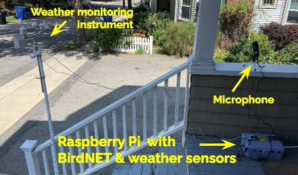

## Bird Conservation

Banri is a bird watcher/citizen scientist who cares about the future of birds. In our effort to empower those committed to bird conservation, we have created three interactive maps: 

(1) Heatmap of bird observations in New England

(2) Choropleth map focusing on Massachusetts

(3) WBGT-based heat risk map for birds

The heatmap provides a broad view of where birds are most frequently observed across New England, helping users identify key migratory patterns, especially during peak times like the upcoming World Migratory Bird Day. 

The choropleth map offers a closer look at Massachusetts, encouraging bird watchers to explore highly-reported and under-reported areas and contribute valuable observations to citizen science. 

Lastly, the WBGT-based heat risk map is essential during the summer months, highlighting regions where birds are at risk of heat stress, thus guiding efforts to protect and rescue vulnerable avian populations. 

We have integrated these maps with a half-reflective mirror to produce a "smart" mirror. It is intended to foster a community of informed and proactive individuals dedicated to supporting bird migration and health amid the challenges posed by climate change.

In addition, we have developed a portable Internet-of-Things (IoT) platform that detects and identifies birds based on their songs while automatically collecting and compiling real-time data on both bird activity and specific weather conditions such as temperature, humidity, light, atmospheric pressure, wind speed, rain, and wind direction. This platform empowers community members concerned with the impacts of climate change on birds to explore potential correlations between bird activity and weather conditions. The three maps guide users on where to deploy the device, depending on their specific objectives.

