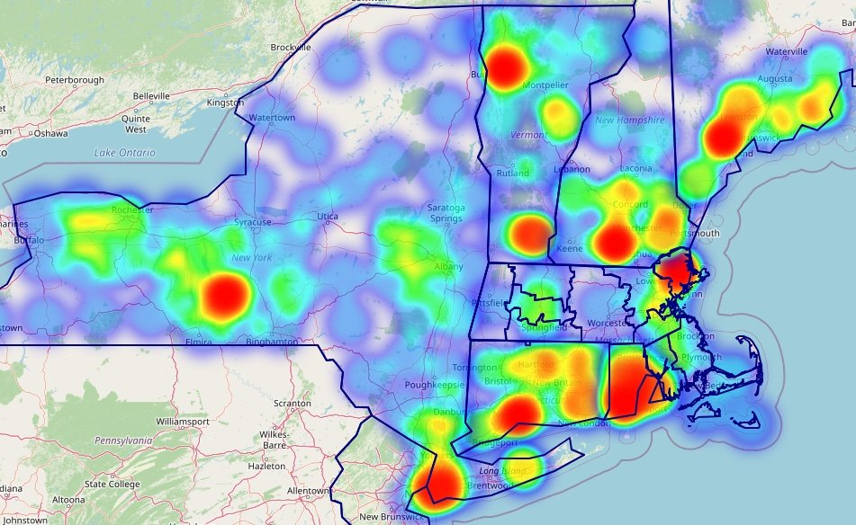

## Bird Conservation

Banri is a bird watcher/citizen scientist who cares about the future of birds. In our effort to empower those committed to bird conservation, we have created three interactive maps: 

(1) Heatmap of bird observations in New England

(2) Choropleth map focusing on Massachusetts

(3) WBGT-based heat risk map for birds

The heatmap provides a broad view of where birds are most frequently observed across New England, helping users identify key migratory patterns, especially during peak times like the upcoming World Migratory Bird Day. 

The choropleth map offers a closer look at Massachusetts, encouraging bird watchers to explore highly-reported and under-reported areas and contribute valuable observations to citizen science. 

Lastly, the WBGT-based heat risk map is essential during the summer months, highlighting regions where birds are at risk of heat stress, thus guiding efforts to protect and rescue vulnerable avian populations. 

