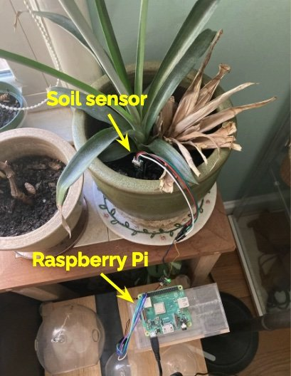

## Farming

Hiroki is a serious volunteer for local farms that are of and for individuals with autism. As Massachusetts faces droughts once in a few years, we aim to empower those farms to run in a sustainable manner. 

We mapped regional weather information such as historical weather data (hythergraphs), weather forecasts, and drought severity. We also built an in-situ farm monitoring device that can measure soil temperature and moisture, air temperature, humidity and atmospheric pressure. It stores and graphs sensor data in a cloud data storage. These tools are intended to help farmers make informed decisions for their planning and operation; for example, when to and how much to water crops. 

