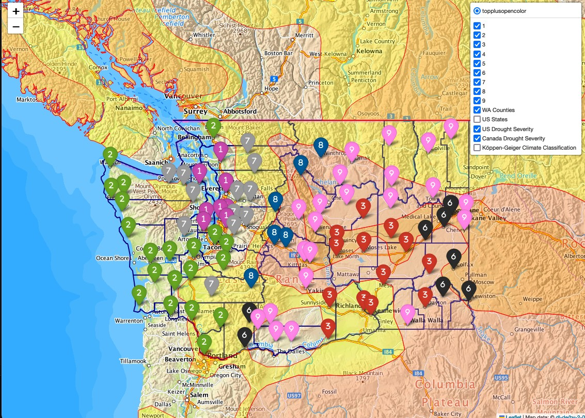
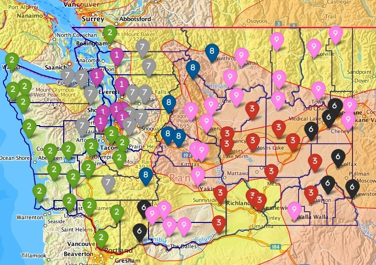
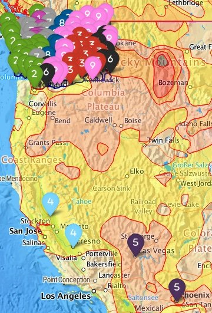
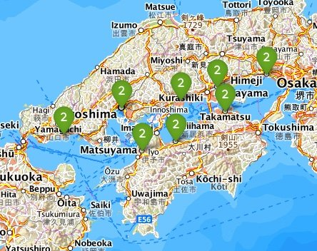
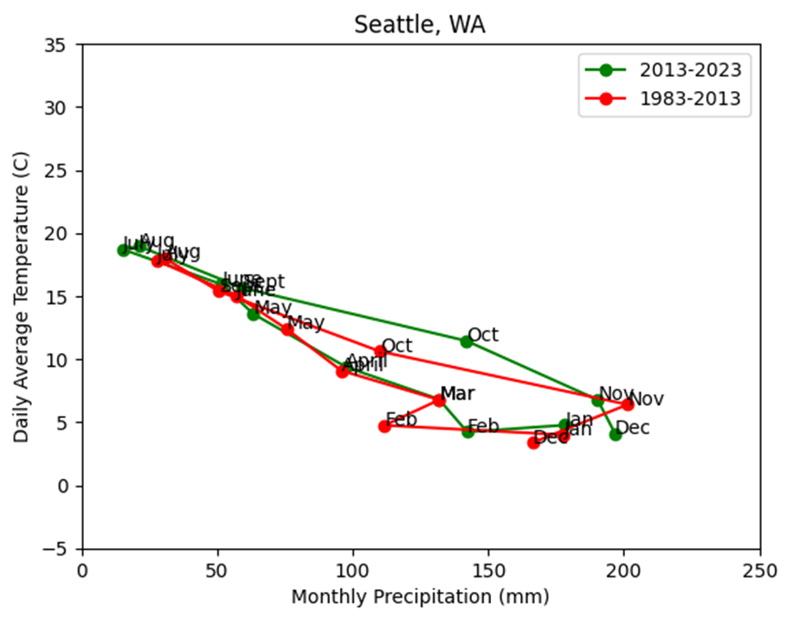
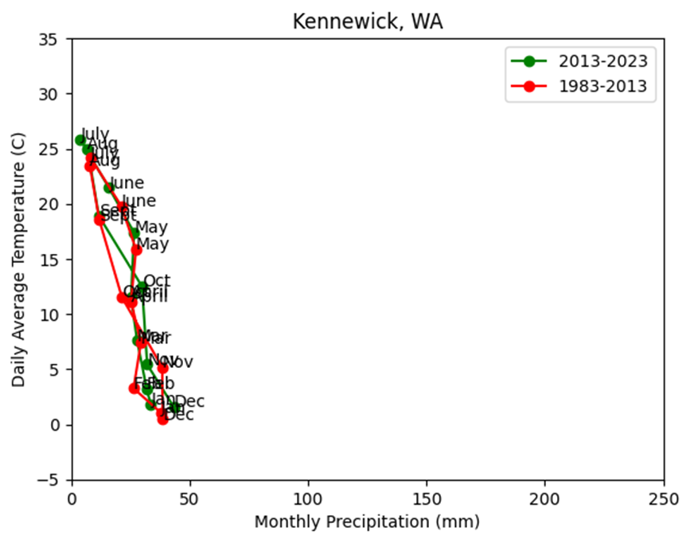

## Mapping and Analyzing Climates in WA

Yuma studies an intersection of climatology, drought and geography in the state of Washington. He moved from Massachusetts to Washington three years ago during summer, thinking that since both are northern states, they would have similar climates. However, he has been surprised by many differences actually. One of the biggest differences is the occurrence of droughts. In April 2024, a state drought emergency was declared for all areas of the state except for Seattle, Tacoma and Everett. Water supply level went below 75% of the usual. The state government budgeted 4.5 million dollars to combat this situation. Moreover, this isn’t just a one-time event, but it happens almost every year.

Therefore, we decided to analyze climates in WA by clustering cities based on three climatology/geographical features (irradiance, soil wetness and elevation) with 10-year (2014-2023) data. We chose nine clusters with a dendrogram from bottom-up clustering and analyzed those cities in three-dimensional feature space. We also mapped cluster distribution on a map with extra layers for drought severity and Köppen climate classification.

We found monsoons and the locations of mountain ranges have great impacts on climate. Washington, California, Arizona, and Japan share the same climatological & geographical characteristics. In fact, western WA and western Japanese cities are placed in the same cluster. 

We also produced "hythergraphs" for individual cities for further analysis. They illustrate monthly changes in air temperature and precipitation in recent 10 years (2014-2023) and extra 30 years (1984-2013). By comparing those 10-year and 30-year data, we found that the climate of WA cities has changed to be warmer and drier. 

