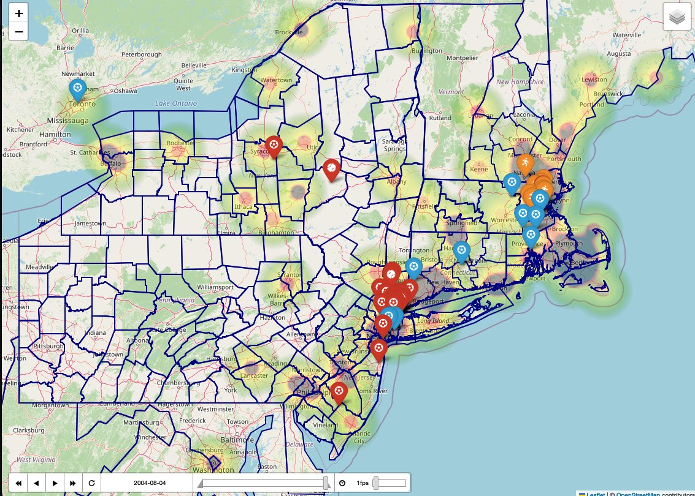

## Mapping Heat Risk for Outdoor Athletes

Shun, Hanna, and Rei are all serious athletes. In the summer, they all play their sports outside in the midst of intense heat and humidity. When engaging in physical activities in these conditions, athletes need to be cautious about heat strokes. Heat stroke is one of the main causes of athlete deaths and fatalities, and it is the number one risk in the summer. The death and ER rates due to heat stroke have been increasing in recent years. There have been about 20 athlete deaths from heat in the past 10 years and 67 high school athlete deaths in the past 40 years, with the majority occurring on days with elevated Wet Bulb Globe Temperature (WBGT) values. WBGT indicates heat stress on the body in direct sunlight. It takes into account such factors as air temperature, humidity, solar heat and wind speed. It is recommended as a reliable risk indicator of heat stroke by professional and high school athletic communities. There is a widely-accepted heat policy chart with 5 alert levels that indicate the risk associated with particular WBGT values. 

The goal of our project is to become more aware and precautious of the health risk during physical activities and to prevent heat-related illness. To meet this goal, we mapped the locations of the facilities that we tend to play sports at and overlaid WBGT values in the last 4 days as an animated heatmap. From the highest WBGT level to lowest, the colors are black, red, orange, yellow, and green. By viewing the heat map, coaches and players can determine whether to play outside or the intensity of the practice at that particular time and location. For instance, a region labeled in red recommends a maximum of 1 hour training with 4 by 4 minute breaks within the hour.

